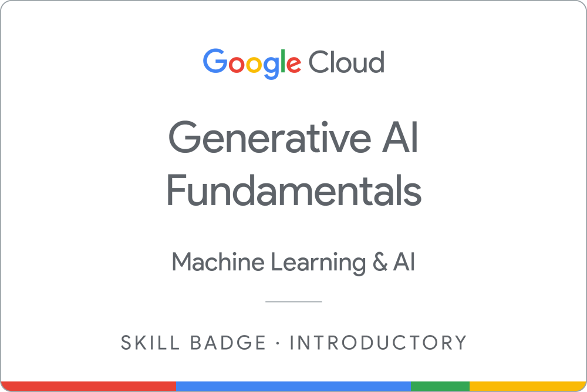
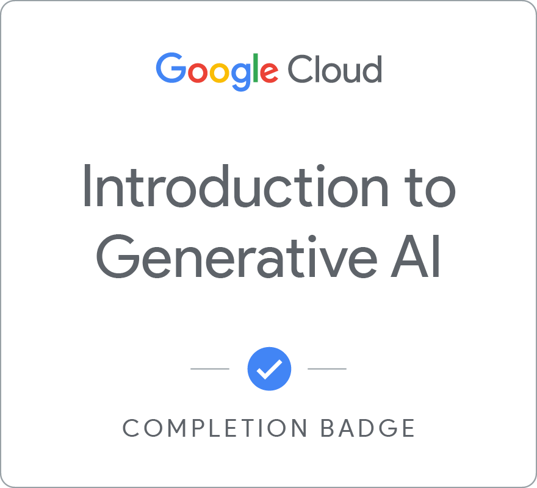
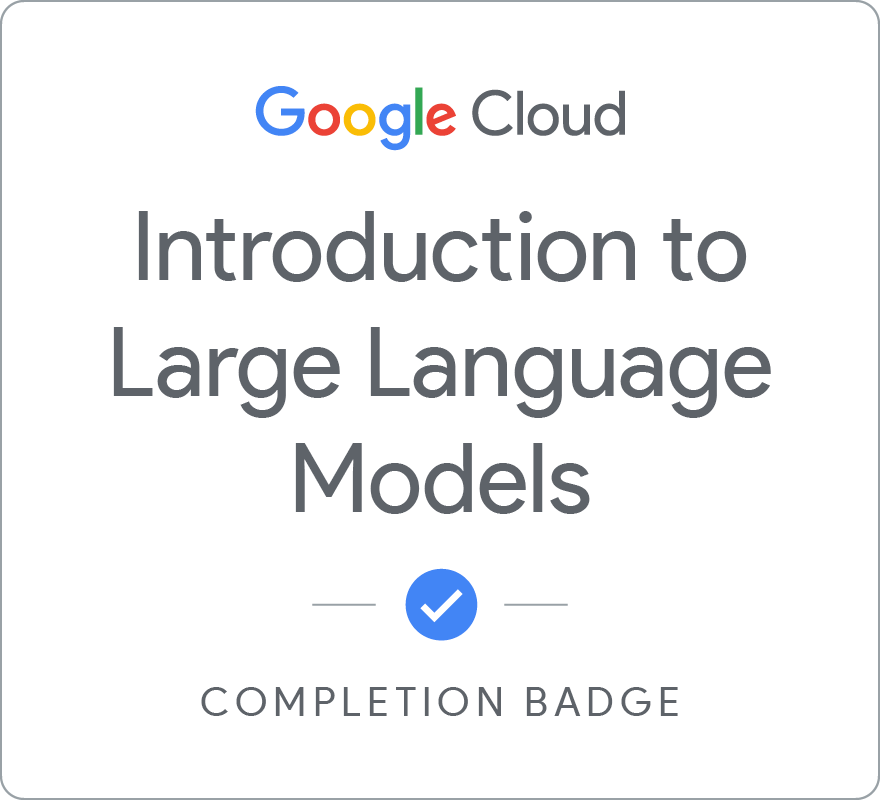
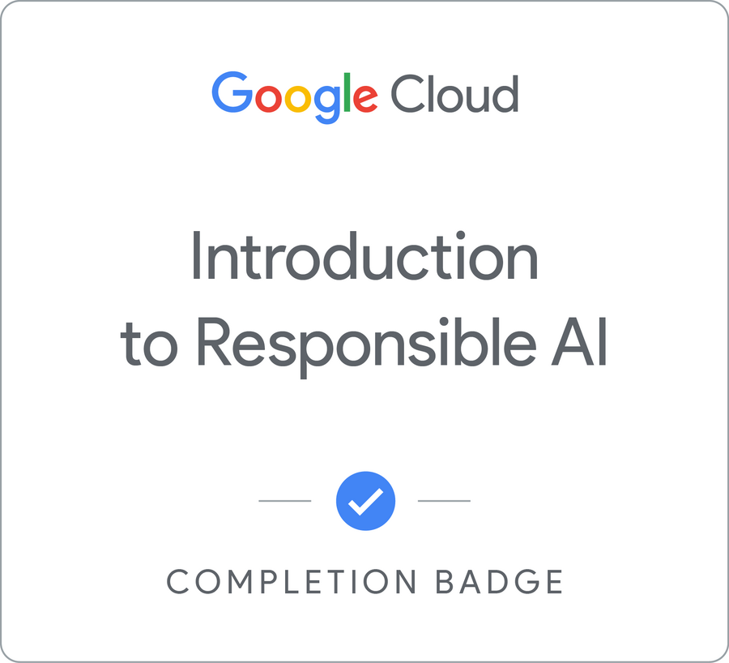
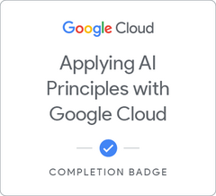

#Introduction to Generative AI Learning Path

_Alistair Boyer_

- Notes from <a href="https://www.cloudskillsboost.google/paths/118">Google Cloud Skills Boost Course</a>

## Introduction to Generative AI

### Google Generative AI Course - Learning Objectives
- Generative AI Definition
- Generative AI Operation
- Generative AI Models
- Generative AI Applications

### AI vs Machine Learning vs Deep Learning
- AI is a branch within computer science
- AI is building computer systems that think and act as if they have human intelligence
- ML is training computers to predict and learn based upon data
- ML can learn and improve based on the dataset
- DL is a subset of ML
- Dl  uses artificial neural networks that can process more complex patterns than machine learning
- Generative AI is a subset of DL - it use that leverages both supervised, unsupervised and semi-supervised methods
- Large Language Models are a type of generative AI

### Discriminative vs Generative
- Discriminative
    - used to classify or predict
    - usually operates using labelled data
    -
$ y $ is a number, class or probability

- Generative
    - generates data similar to data it has been trained on
    - understands data distribution and probability to build a
    - builds a __foundation model__
    - generates new content based on the foundation model
    -
$ y $ is language, audio, images
    

### Transformers
- Input $ \to $ Transformer [Encoding $ \to $ Decoding] $ \to $ Pre-trained Transformer Model $ \to $ Output
- Hallucinations
  - Examples
    - Factually incorrect
    - Sensibly incorrect
    - Grammatically incorrect
  - Causes
    - Not enough data
    - Noisy data
    - Not enough context
    - Not enough constraints
- Prompts
  - Short piece of input text
  - Determines quality and content of output

### Model Types
- Text $ \to $ Text
  - Translation
  - Creating a Summary
  - Correction
  - PaLM: Pathways Language Model; LaMDA: Language Model for Dialogue Applications; GPT
- Text $ \to $ Image (Video, 3D)
  - Based on image data and associated captions and content
  - Stable Diffusion, DALL·E, Midjourney, Adobe Firefly, Generative AI by Getty, Google Gemini
- Text $ \to $ Task
  - Navigate webs
  - Operate home automation
- Decisions
  - Game Playing
  - Deep Blue
  - AlphaGo
- Audio
- Image

### Foundation Models
- Basis of Generative AI
- Language
  - PaLM: Pathways Language Model $\to$ Chat, Text
  - BERT
- Vision
  - Embeddings Extractor
  - Stable Diffusion
  - GPT
  - BLIP: Image Captioning

### Google Products
- Bard
- Vertex AI Studio
- Vertex AI
- PaLM API
- Gemini
- Model Garden: https://cloud.google.com/model-garden

## Large Language Models

### Terminology
- _Large_: training dataset __AND__ parameter count
- Few shot: models with minimal training data
- Zero shot: recognise input that has not been taught
- Prompt Design: creating a prompt that achieves the desired task
- Prompt Engineering: optimizing a prompt for efficient use of the LLM

### LLMs
- Not many organisations have resources to create LLM $\to$ use LLMs created by large organisations and fine tune them
- Performance grows as more data and parameters are added
- Can use LLMs without expertise in ML and shortcut the compute time of model generation
- Types
  - Generic: next word predictor
  - Instruction Tuned: respond to instructions
  - Dialogue Tuned: focused on conversation
  - Chain of through reasoning: models are better at getting the desired answer when they explain their working

### Google PaLM - Pathways Language Model
- 540 billion parameters
- dense decoder-only model
- uses __Pathway__ architecture - single model trained across multiple tasks

### Transformer Model
- Encoder $\to$ Decoder

### Application of Models
- Tuning
  - Need to train model on custom data for specific task
- Fine Tuning
  - can be expensive and unrealistic
- Parameter-efficient tuning methods (__PETM__):
  - prompt tuning

### Challenges
- Hallucination - generation of unrealistic responses
- Factuality - incorrect information
- Anthropomorphisation - presenting human features from inanimate objects, including LLMs

# AI Ethics

## AI Ethics and Business

> PricewaterhouseCoopers suggests that AI could boost global GDP by 14%, or up to $15.7 trillion, by 2030

### Staying Ahead of the Curve. The Business Case for Responsible AI
- A report from Google developed by The Economist Intelligence Unit (EIU)
- EIU Report: https://www.eiu.com/n/staying-ahead-of-the-curve-the-business-case-for-responsible-ai/
- Capgemini Research: https://capgemini.com/research/ai-and-the-ethical-conundrum/
1. Incorporating responsible AI practices is a smart investment in product development
  - 97% of respondents agree ethical AI reviews are important
  - 90% AI organisations encounter ethical issues [Capgemini]
  - 40% abandoned project after having ethical issues
  - Incorporating ethical considerations early helps reduce costs from fixing downstream problems
  - Companies that have deployed AI are 1.7 $\times$ more likely to be guided by responsible AI
  - Responsible AI creates trust with stakeholders and boosts value to users; and competitive advantage
2. Responsible AI trailblazers attract and retain top talent
  - Top workers are 400% more productive on average; and 800% more productive in complex occupations
  - Responsible AI is a key consideration for top talent [Deloitte]
  - Responsible AI helps trust between employee and employer
3. Safeguarding Promise of Data
  - 90% of customers will avoid a company with a data breach
  - Average data breach costs $3.92 [up to $8.19 in the US]
  - 36% of cost of data breach is lost business
  - Customers blame data breach on organisations rather than hackers
  - Building trust means more data is trusted to an organisation leading to better models
  - \\$1 investment in data security generates \\$2.70 return
4. Prepare in advance of AI regulation
  - Governments are actively developing AI policy
  - Reduce risk of non-compliance
  - Contribute to regulation conversation
  - Example - organisations were not prepared for GDPR by factor of 2.71 $\times$ \
  Only 13% of damage was fines, with rest being productivity loss and disruption
5. Responsible AI can improve revenue growth
  - 91% organisations have requirement for responsible AI in proposal process
  - 66% have decided to avoid working with vendors with ethical concerns
  - 66% customers willing to pay more for ethical goods and services
6. Powering up partnerships
  - Investors have increasing emphasis on ethical beliefs
7. Maintain strong trust and branding
  - Not just negative effects from lack of ethics but image bonus from having responsible AI

## AI Ethics

See also, notes on [Ethics of AI!](Ethics_of_AI.md)

### AI Ethics
- Articulating values and justiyfing actions based on those values in the form of \
rights, obligations, benefits and virtues

### Ethical Concerns
- Transparency: AI systems are highly complex by design; Transparency is important for users trust; Transparency is important for developers to control output
- Unfair Bias: AI can amplify unfair bias, it is trained on data that is subject to societal bias
- Security: Bad actors can exploit vulnerabilities and the impact increases as AI is more widely adopted. Also AI brings new challenges such as deepfakes.
- Privacy: AI can quickly combine and analyse data, giving rise to unwanted personal identification
- Pseudoscience: AI can be applied to unscientific practices such as face analysis for criminal risk
- Accountability to People: There should be mechanisms for intervention and feedback
- Unemployment and deskilling: society has faced technological advances but AI is advancing at a greater rate than ever before. This creates a challenge to adapt roles that work with AI

### AI Can Contribute to Ethical Problems
- Improving materials, designs and processes
- Increase affordability
- Provide freedom from repetitive tasks
- Spotting inequality

### AI and Responsibility
- AI can be harmful
- Responsible AI is being defined by individual organisations but there are common themes
  - Transparency
  - Fairness
  - Accountability
  - Privacy
- AI is not responsible, it is created and applied by individuals who are responsible
- Trust is an important part of AI products and relies on responsible AI

### Sources of Ethics Problems
- Lack of resources
- Lack of diversity in teams
- Lack of ethical framework

### Ethics Spotting
- To address ethical concerns, they must first be identified
- Decision trees and checklists are not suited to this task, due to emerging risks from fast developing technology
- Need to appreciate ethics at all levels and incorporate ethics conversation into all parts of development

## AI Ethics at Google

### Google's AI Ethics
- https://cloud.google.com/responsible-ai
- Began in 2017 when Google was designated an AI-First organisation
- Driven by individuals across all backgrounds within Google
- Built a list of considerations based on research: scientific literature and general opinion on concerns within AI; and portrayal of AI in media, including science fiction
- Compare with outside expertise from lawyers and AI ethics researchers to identify gaps
- Iterate and improve
- Include 4 areas not to pursue as guard-rails
- Incorporated into daily practice

### Google's Ethics Principles
- https://ai.google/principles/
- https://blog.google/technology/ai/ai-principles/
1. AI should be socially beneficial
  - manage severity, likelihood and extent to diminish risk
1. AI should avoid creating and reinforcing bias
  - monitor for representation within data (and lack thereof)
1. AI should be build and tested for safety
  - limit reliance on technology
1. AI should be accountable to people
  - informed user consent
1. AI should incorporate privacy by design
  - protect data that identifies individuals
1. AI should uphold high standards of scientific excellence
  - create credible output that passes rigorous scientific standards
1. AI should be made available (according to these principles)
  - accountability

- AI not to be used for harm
- AI not to be deployed in weapons
- AI not to be deployed in surveillance that violates internationally accepted norms
- AI not to be contravene human rights and international law

### Responsible Innovation Team
- Provides guidance across google
- Interprets ethics policies
- Calibrates decision making
- Inputs from user researchers, social scientists, ethics researchers, human rights specialists, policy and privacy advisors,  legal experts and others
- Experts, provide input based on emerging technology
- Senior executives, handle largest and most complex challenges
- Custom AI governance committees embedded in product development teams

### Running Reviews at Google
- Customer AI deal review: considers early stage of projects and investigates if has clashes with ethical principles
  - Ethics by design
  -  Preliminary review - meetings every two weeks
  - Review brief - intended goals, business problem solved, data being used, model and monitoring details, societal context, risks and harms, alignment plan (to ethics principles)
  - Discuss and align with alignment plan
  - Final approval of alignment
- Cloud AI development review: monitor scope, assessment and governance of projects before release
  - Sales deal submission
  - Preliminary review (by AI principles and responsible innovation teams)
  - Review, discuss and decide, careful consideration of deal: go forward, don't go forward, add certain requirements, escalate
- Tackling AI Problems
  - Narrow scope
  - Launch with allow list
  - Provide added educational materials

### Case Study - Celebrity Recognition
- <a href="https://cloud.google.com/blog/products/ai-machine-learning/celebrity-recognition-now-available-to-approved-media-entertainment-customers">Product Release Statement</a>
- For Media and Entertainment Customers
- Pre-trained based on licensed images
- First Google enterprise product with <a href="https://ai.google/responsibilities/facial-recognition/">facial recognition</a>
- Externally validated with _Business for Social Responsibility_ (BSR) [<a href="https://bsr.org/en/our-insights/blog-view/google-human-rights-impact-assessment-celebrity-recognition">Report</a>]
- Safeguards:
  - Allow list
  - Extended terms of service
- Fairness analysis: evaluate recall and precision
  - Found bias - skin tone labels were incorrect (https://gendershades.org) [<a href="https://proceedings.mlr.press/v81/buolamwini18a/buolamwini18a.pdf">Research Article</a>]
  - Relabelled the skin tones according to the Fitzpatrick skin type scale
  - Errors persisted, focussed on small set of black actors and had difficulty with associating them across age ranges
  - Solved by extending dataset to include those actors at more stages throughout their careers
  - Today, Google has released the <a href="https://blog.google/products/search/monk-skin-tone-scale/">Monk Skin Tone (MST) Scale</a>

### Issue Spotting
- Guide required - but not simple checklist - focus on questions that promote critical thinking
  - Purpose and importance
  - Social benefit
  - Potential for misuse

### Best Practices
- Diverse review committee that represents user base
- Organisation-wide adoption of responsible AI practices from the bottom up
- Transparency in the governance process - track the decision-making process
- Psychological safety - confidence to explore what if - but grounded in technical and business challenges

## Reading Material

### Generative AI
- Ask a Techspert: What is generative AI? \
https://blog.google/inside-google/googlers/ask-a-techspert/what-is-generative-ai/
- What is generative AI? \
https://www.mckinsey.com/featured-insights/mckinsey-explainers/what-is-generativeai
- Background: What is a Generative Model?\
https://developers.google.com/machine-learning/gan/generative
- Gen AI for Developers\
https://cloud.google.com/ai/generative-ai?hl=en#developer-resources
- Google Research, 2022 & beyond: Generative models: \
https://ai.googleblog.com/2023/01/google-research-2022-beyond-language.html#GenerativeModels
- Building the most open and innovative AI ecosystem: \
https://cloud.google.com/blog/products/ai-machine-learning/building-an-open-generative-ai-partner-ecosystem
- Generative AI is here. Who Should Control It? \
https://www.nytimes.com/2022/10/21/podcasts/hard-fork-generative-artificial-intelligence.html
- Stanford U & Google's Generative Agents Produce Believable Proxies of Human Behaviors: \
https://syncedreview.com/2023/04/12/stanford-u-googles-generative-agents-produce-believable-proxies-of-human-behaviours/
- Generative AI: Perspectives from Stanford HAI: \
https://hai.stanford.edu/sites/default/files/2023-03/Generative_AI_HAI_Perspectives
- Generative AI at Work: \
https://www.nber.org/system/files/working_papers/w31161/w31161.pdf
- The future of generative AI is niche, not generalized: \
https://www.technologyreview.com/2023/04/27/1072102/the-future-of-generative-ai-is-niche-not-generalized/
- The implications of Generative AI for businesses: \
https://www2.deloitte.com/us/en/pages/consulting/articles/generative-artificial-intelligence.html
- Proactive Risk Management in Generative AI: \
https://www2.deloitte.com/us/en/pages/consulting/articles/responsible-use-of-generative-ai.html
- How Generative AI Is Changing Creative Work: \
https://hbr.org/2022/11/how-generative-ai-is-changing-creative-work

### Large Language Models:
- Introduction to Large Language Models\
https://developers.google.com/machine-learning/resources/intro-llms
- Language Models are Few-Shot Learners:\
https://proceedings.neurips.cc/paper/2020/file/1457c0d6bfcb4967418bfb8ac142f64aPaper.pdf
- Getting Started with LangChain + Vertex AI PaLM API\
https://github.com/GoogleCloudPlatform/generative-ai/blob/main/language/orchestrati
on/langchain/intro_langchain_palm_api.ipynb
- Learn about LLMs, PaLM models, and Vertex AI\
https://cloud.google.com/vertex-ai/docs/generative-ai/learn-resources
- Building AI-powered apps on Google Cloud databases using pgvector, LLMs and LangChain\
https://cloud.google.com/blog/products/databases/using-pgvector-llms-and-langchain-with-google-cloud-databases
- Training Large Language Models on Google Cloud\
https://github.com/GoogleCloudPlatform/llm-pipeline-examples
- Prompt Engineering for Generative AI\
https://developers.google.com/machine-learning/resources/prompt-eng
- Parameter-efficient fine-tuning of large-scale pre-trained language models\
https://www.nature.com/articles/s42256-023-00626-4
- Parameter-Efficient Fine-Tuning of Large Language Models with LoRA and QLoRA\
https://www.analyticsvidhya.com/blog/2023/08/lora-and-qlora/
- NLP's ImageNet moment has arrived: \
https://thegradient.pub/nlp-imagenet/
- LaMDA: our breakthrough conversation technology: \
https://blog.google/technology/ai/lamda/
- Language Models are Few-Shot Learners: \
https://proceedings.neurips.cc/paper/2020/file/1457c0d6bfcb4967418bfb8ac142f64aPaper.pdf
- PaLM-E: An embodied multimodal language model: \
https://ai.googleblog.com/2023/03/palm-e-embodied-multimodal-language.html
- PaLM API & MakerSuite: an approachable way to start prototyping and building generative AI applications: \
https://developers.googleblog.com/2023/03/announcing-palm-api-and-makersuite.html
- The Power of Scale for Parameter-Efficient Prompt Tuning: \
https://arxiv.org/pdf/2104.08691.pdf
- Google Research, 2022 & beyond: Language models: \
https://ai.googleblog.com/2023/01/google-research-2022-beyond-language.html#LanguageModels
- Solving a machine-learning mystery: \
https://news.mit.edu/2023/large-language-models-in-context-learning-0207

### Additional Resources for Machine Learning
- Attention is All You Need: \
https://research.google/pubs/pub46201/
- Transformer: A Novel Neural Network Architecture for Language Understanding: \
https://ai.googleblog.com/2017/08/transformer-novel-neural-network.html
- Transformer on Wikipedia: \
https://en.wikipedia.org/wiki/Transformer_(machine_learning_model)#:~:text=Transformers%20were%20introduced%20in%202017,allowing%20training%20on%20larger%20datasets.
- What is Temperature in NLP? \
https://lukesalamone.github.io/posts/what-is-temperature/
- Auto-generated Summaries in Google Docs: \
https://ai.googleblog.com/2022/03/auto-generated-summaries-in-google-docs.html

### Responsible AI

- Stanford University – Artificial Intelligence Index Report 2019 \
https://hai.stanford.edu/sites/default/files/ai_index_2019_report.pdf
- ZME Science: AI is outpacing Moore's Law \
https://zmescience.com/science/ai–is-outpacing-moores-law
- Quartz: The data that transformed AI research—and possibly the world \
https://qz.com/1034972/the-data-that-changed-the-direction-of-ai-research-and-possibly-the-world/
- Google Research, 2022 & beyond: Responsible AI \
https://ai.googleblog.com/2023/01/google-research-2022-beyond-responsible.html
- Responsible AI at Google Research: PAIR \
https://ai.googleblog.com/2023/05/responsible-ai-at-google-research-pair.html
- Responsible AI at Google Research: Technology, AI, Society and Culture \
https://ai.googleblog.com/2023/04/responsible-ai-at-google-research.html
- Responsible AI at Google Research: The Impact Lab \
https://ai.googleblog.com/2023/03/responsible-ai-at-google-research.html

- Google Responsible AI practices: Interpretability \
https://ai.google/responsibilities/responsible-ai-practices/?category=interpretability
- Google Cloud Whitepaper: AI Explainability \
https://storage.googleapis.com/cloud-ai-whitepapers/AI%20Explainability%20Whitepaper.pdf
- Google People + AI Guidebook: Explainability + Trust \
https://pair.withgoogle.com/chapter/explainability-trust

- E&T: Building digital trust will be essential to adoption of AI tools
https://eandt.theiet.org/content/articles/2020/11/building-digital-trust-will-be-essential-to-adoption-of-ai-tools/
- The Harvard gazette: Ethical concerns mount as AI takes bigger decision–making role in
more industries \
https://news.harvard.edu/gazette/story/2020/10/ethical-concerns-mount-as-ai-takes-bigger-decision-making-role/
- Venturebeat: Responsible AI becomes critical in 2021 \
https://venturebeat.com/2020/11/11/responsible-ai-becomes-critical-in-2021/
- Capgemini Research Institute full report: AI and the Ethical Conundrum \
https://capgemini.com/wp-content/uploads/2020/10/AI-and-the-Ethical-Conundrum-Report.pdf
- Nautilus: Is Artificial Intelligence Permanently Inscrutable? \
https://nautil.us/is-artificial-intelligence-permanently-inscrutable-5116/

- Blog: Google AI Principles updates, six months in \
https://blog.google/technology/ai/google-ai-principles-updates-six-months
- Blog: An update on our work on AI and responsible innovation \
https://blog.google/technology/ai/update-work-ai-responsible-innovation/
- Blog: Taking care of business with Responsible AI \
https://cloud.google.com/blog/products/ai-machine-learning/taking-care-of-business-with-responsible-ai
- Blog: Responsible AI: Putting our principles into action \
https://blog.google/technology/ai/responsible-ai-principles/
- Nature: The global landscape of AI ethics guidelines \
https://nature.com/articles/s42256-019-0088-2
- Berkman Klein Center: Principled Artificial Intelligence: Mapping Consensus in Ethical and
Rights-Based Approaches to Principles for AI \
https://papers.ssrn.com/sol3/papers.cfm?abstract_id=3518482
- Markkula Center for Applied Ethics: Technology and Engineering Practice: Ethical Lenses to Look Through \
https://scu.edu/ethics-in-technology-practice/ethical-lenses/
- TensorFlow: Responsible AI Toolkit \
https://tensorflow.org/responsible_ai
- World Economic Forum: Empowering AI Leadership – C-Suite Toolkit \
https://weforum.org/reports/empowering-ai-leadership-ai-c-suite-toolkit
- World Economic Forum: AI Ethics Framework \
https://weforum.org/projects/ai-ethics-framework

- World Economic Forum: Ethics by Design: An organizational approach to responsible use
of technology \
https://weforum.org/whitepapers/ethics-by-design-an-organizational-approach-to-responsible-use-of-technology
- Google: The value of a shared understanding of AI models \
https://modelcards.withgoogle.com/about

- Markkula Center for Applied Ethics: A Framework for Ethical Decision Making \
https://cloud.google.com/responsible-aiscu.edu/ethics/ethics-resources/a-framework-for-ethical-decision-making/
- Google Whitepaper: Perspectives on Issues in AI Governance \
https://cloud.google.com/responsible-aiai.google/static/documents/perspectives-on-issues-in-ai-governance.pdf
- Google Whitepaper: Building a responsible regulatory framework for AI
https://ai.google/static/documents/building-a-responsible-regulatory-framework-for-ai.pdf

