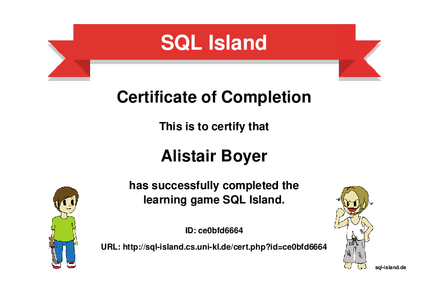

# Exercises from the DigitalFutures Course
_Alistair Boyer_

### books.toscrape.com
- Scraping from https://books.toscrape.com
- Collect all book information into a pandas.DataFrame, clean and display selected charts.
- https://colab.research.google.com/drive/11jdTmieKJ5WF9SOrkBeagmmuiMFyEWjJ

### Murder Mystery Challenge
- SQL Murder Mystery Challenge from Knight Lab at Northwestern University 
- [https://mystery.knightlab.com/](https://mystery.knightlab.com/) 
- Solution: [SQL_Murder_Mystery.sql](SQL_Murder_Mystery.sql)

### Escape from Mystery SQL Island
- SQL Challenge from TU Kaiserslautern
- [https://sql-island.informatik.uni-kl.de/](https://sql-island.informatik.uni-kl.de/)
- [Certificate](http://sql-island.cs.uni-kl.de/cert.php?id=ce0bfd6664)

&nbsp;&nbsp;&nbsp;&nbsp;&nbsp;&nbsp;&nbsp;&nbsp;&nbsp;&nbsp;&nbsp;&nbsp;&nbsp;&nbsp;&nbsp;&nbsp;&nbsp;

