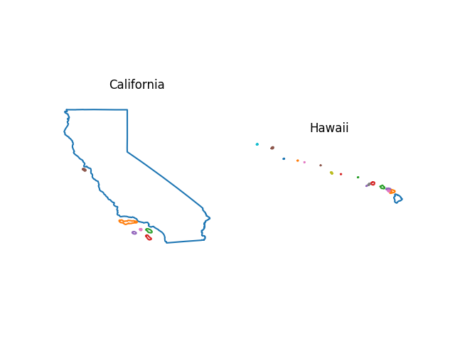

# Selection of Useful Python Functions

- includes miscellaneous tools and personal implementations of key concepts in data science

## Plot State
- add the outline of a state to any object with an appropriate `.plot()` method
- gets data from https://public.opendatasoft.com/explore/dataset/us-state-boundaries
- except california that is cached within the file

```python
def plot_state(state_name, ax, transform=None, force_download=False, **kwargs) -> None:
    """
    plot a state outline on an object with an appropriate `.plot()` method  using data from
    https://public.opendatasoft.com/explore/dataset/us-state-boundaries/

    if no color is specified then kwargs 'color' set to 'black'

    Args:
        state_name (str): full name of the state.
        transform (None | Callable[[numpy.Array], numpy.Array]):
            apply a transform to the coordinates before plotting.
            The Callable argument should transform a numpy.arrray of shape (n, 2)
                holding multiple [longitude, latitude] datapoints into another (n, 2) array.
            Defaults to None for no transform.
        force_download (bool):
            when True will attempt to recover geometry from the local cache before downloading
            otherwise will download outline data every time. Defaults to False.
        ax (Any): an object with a .plot(xy, ys, **kwargs) method.
        **kwargs (Any): passed to ax.plot().
    """
```

example:
```python
import matplotlib
import matplotlib.pyplot as plt

fig, ax = plt.subplots(1, 2)
for n, state in enumerate(["cAlifOrnia", "Hawaii"]):
    # plot state! Set color=None to override default color=black and get multicolor outlines
    plot_state(state, ax[n], color=None)
    # title
    ax[n].set_title(state.title())
    # hide border
    ax[n].axis('off')
    # equal aspect ratio
    ax[n].set(aspect='equal')
    # set same scale for y axis to maintain scale N.B. aspect='equal'
    ax[n].set_ylim(ax[n].get_ylim()[0], ax[n].get_ylim()[0]+11)

plt.show()
```
