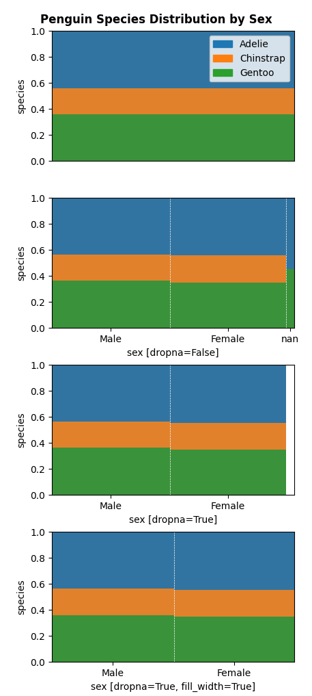

# Miscellaneous Python Functions
_Alistair Boyer_

Miscellaneous tools and personal implementations of key concepts in data science
- [Crosstab Plot](#crosstab-plot): plot cross tabulated data with in a dataframe in a treemap-type diagram.
- [Plot State](#plot-state): plot a US state on an object.

## Crosstab Plot
- add the outline of a state to any object with an appropriate `.plot()` method
- gets data from https://public.opendatasoft.com/explore/dataset/us-state-boundaries
- except california that is cached within the file
```python
def crosstabplot(ax, df, x_label, y_label, y_palette, dropna=False, fill_width=False, sorter=None, vsep=True, **barplotkwargs) -> None:
    """
    Draw a treemap-type crosstab area plot of two (or one) features within a dataframe on an axis.

    Args:
        ax (matplotlib.axis): axis.
        df (pandas.DataFrame): dataframe.
        x_label (str): Label of x series. Set equal to y for a vertical 1-D plot.
        y_label (str): Label of y series. Set equal to x for a vertical 1-D plot.
        y_palette (dict, optional): Dict of {value: color} for the vertical axis. Defaults to None when the palette is automatically generated from the unique values of the data.
        dropna (bool, optional): Drop nan values. Defaults to False.
        fill_width (bool, optional): Fill nans to full width when True or leave space to represent nans when False. Defaults to False.
        sorter (_type_, optional): Sorter for sorting value counts. Defaults to None when descending count is used.
        vsep (bool, optional): Draw vertical separating line. Defaults to True.
        **barplotkwargs (Any): keyword arguments for `sns.barplot()`.
    """
```

example
```python
# get example data
df = seaborn.load_dataset("penguins")

# generate palette
palette = {
    name: seaborn.color_palette()[n]
    for n, name in enumerate(df["species"].unique())
}

# set up axes
fig, axs = plt.subplots(4, 1, sharey=True, figsize=(4, 12))

# do crosstab - 1D "sex" (same label for x and y)
crosstabplot(axs[0], df, "species", "species", y_palette=palette)
axs[0].set_xticks([])
axs[0].set_ylabel("species")
handles = [plt.Rectangle((0, 0), 1, 1, color=color) for color in palette.values()]
axs[0].legend(handles, palette.keys())

# do crosstab - "sex" vs "species"
crosstabplot(axs[1], df, "sex", "species", y_palette=palette)
axs[1].set_xlabel("sex [dropna=False]")
axs[1].set_ylabel("species")

# do crosstab - "sex" vs "species", demonstrate dropna
crosstabplot(axs[2], df, "sex", "species", dropna=True, y_palette=palette)
axs[2].set_xlabel("sex [dropna=True]")
axs[2].set_ylabel("species")

# do crosstab - "sex" vs "species", demonstrate fill_width
crosstabplot(
    axs[3], df, "sex", "species", dropna=True, fill_width=True, y_palette=palette
)
axs[3].set_xlabel("sex [dropna=True, fill_width=True]")
axs[3].set_ylabel("species")

# overall title and layout
fig.suptitle("Penguin Species Distribution by Sex", fontweight="bold")
fig.tight_layout()
plt.show()

```


## Plot State
- add the outline of a state to any object with an appropriate `.plot()` method
- gets data from https://public.opendatasoft.com/explore/dataset/us-state-boundaries
- except california that is cached within the file

```python
def plot_state(state_name, ax, transform=None, force_download=False, **kwargs) -> None:
    """
    plot a state outline on an object with an appropriate `.plot()` method  using data from
    https://public.opendatasoft.com/explore/dataset/us-state-boundaries/

    if no color is specified then kwargs 'color' set to 'black'

    Args:
        state_name (str): full name of the state.
        transform (None | Callable[[numpy.Array], numpy.Array]):
            apply a transform to the coordinates before plotting.
            The Callable argument should transform a numpy.arrray of shape (n, 2)
                holding multiple [longitude, latitude] datapoints into another (n, 2) array.
            Defaults to None for no transform.
        force_download (bool):
            when True will attempt to recover geometry from the local cache before downloading
            otherwise will download outline data every time. Defaults to False.
        ax (Any): an object with a .plot(xy, ys, **kwargs) method.
        **kwargs (Any): passed to ax.plot().
    """
```

example:
```python
fig, ax = plt.subplots(1, 2)
for n, state in enumerate(["cAlifOrnia", "Hawaii"]):
    # plot state! Set color=None to override default color=black and get multicolor outlines
    plot_state(state, ax[n], color=None)
    # title
    ax[n].set_title(state.title())
    # hide border
    ax[n].axis('off')
    # equal aspect ratio
    ax[n].set(aspect='equal')
    # set same scale for y axis to maintain scale N.B. aspect='equal'
    ax[n].set_ylim(ax[n].get_ylim()[0], ax[n].get_ylim()[0]+11)

plt.show()
```
