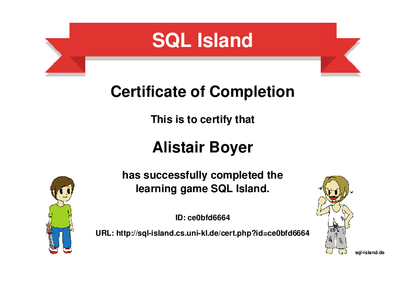

# SQL Challenges

---
## Murder Mystery Challenge 
SQL Murder Mystery Challenge from Knight Lab at Northwestern University \
[https://mystery.knightlab.com/](https://mystery.knightlab.com/) \
Solution: ['SQL_Murder_Mystery.sql'](SQL_Murder_Mystery.sql)

---
## Escape from Mystery SQL Island
SQL Challenge from TU Kaiserslautern \
[https://sql-island.informatik.uni-kl.de/](https://sql-island.informatik.uni-kl.de/) \
 \
[Certificate](http://sql-island.cs.uni-kl.de/cert.php?id=ce0bfd6664)

