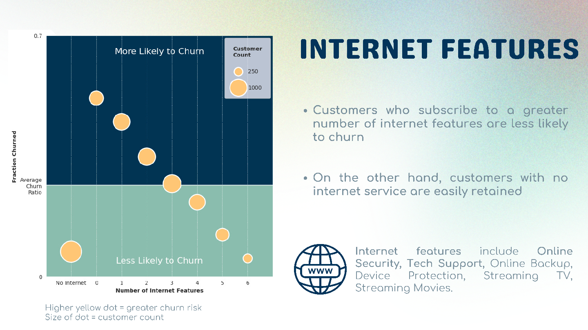
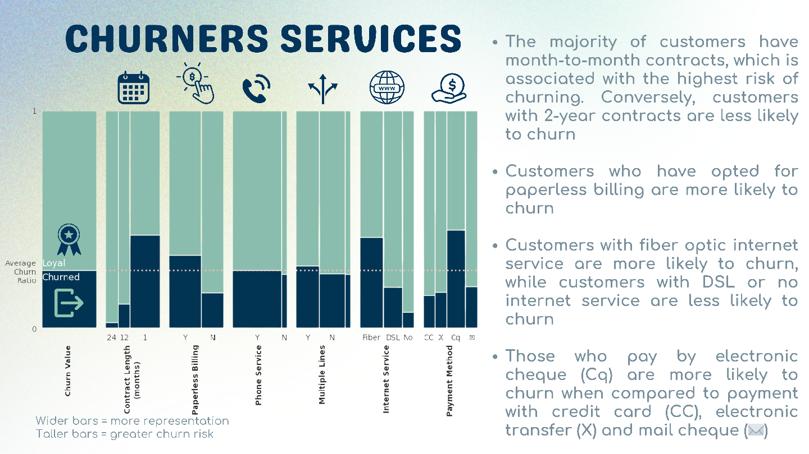
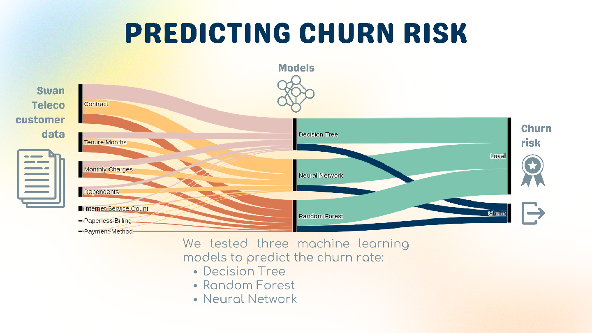

# Churn Analysis
_Alistair Boyer_ \
_Fátima González_ \
_Mary Petrichenko_

### Summary
An analysis of telecoms customer data to predict churn rate. 
- ETL of data.
- Consideration of demographics, contract type and charge data.
- Creation of Decision Tree, Random Forest and Tensorflow predictive models. 
- Preparation of a slide with information highlights and key visualisations. <a href='Willow_SlideDeck.pdf' />Slide Deck [pdf]</a>

### Sample Slides
- Increased number of internet features, or no internet features, correlates with lower churn liklihood
  
- Detailed relationship visualisation of contarct features and relationship with churn liklihood
  
- Simplified visual explanation of the modelling process
  
