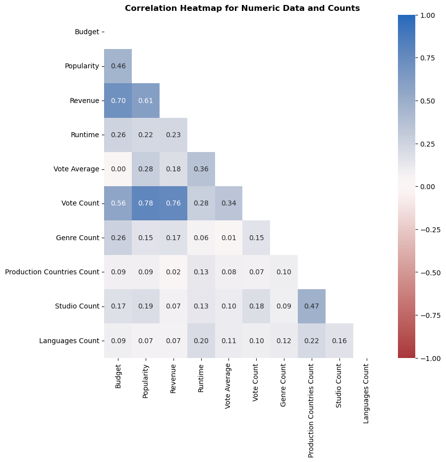
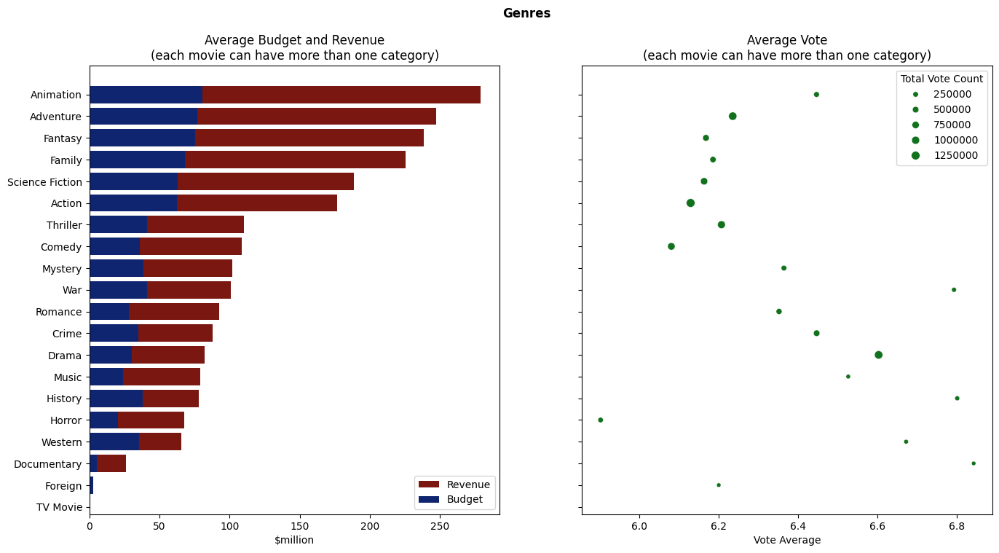
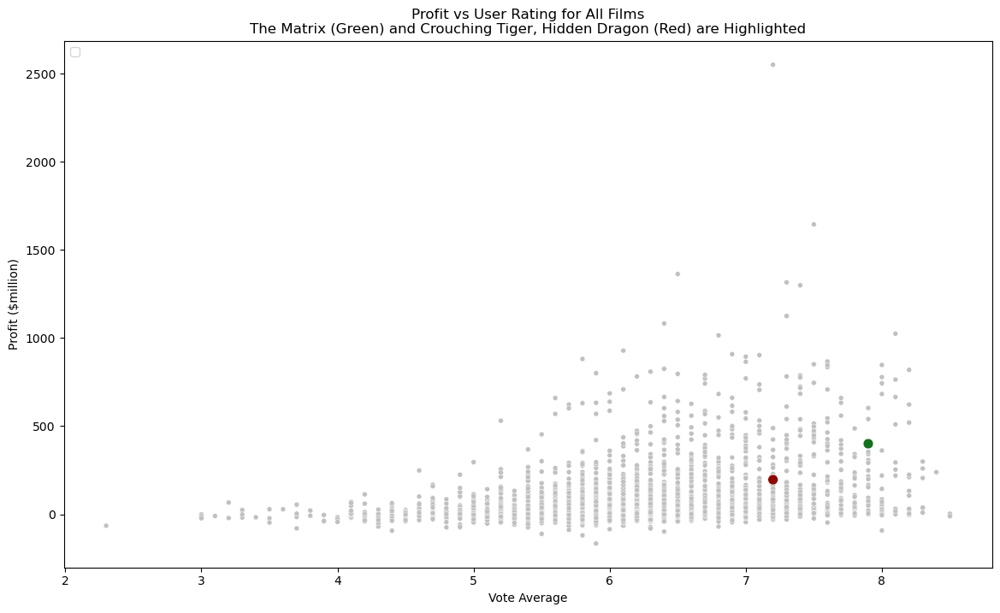

# TMDB Analysis

A .ipynb notebook exploring the TMDB database [https://www.themoviedb.org/](https://www.themoviedb.org/). 

_Alistair Boyer_

## Extract, Transform, Load

<ol>
<li> The data (originally as .csv) was loaded into pandas. </li>
<li> Initial inspection revealed:
    <ul>
    <li> a unique film index </li>
    <li> categorical values for `status` and `original_language` </li>
    <li> release date is a date </li>
    <li> several fields included nested .json data </li>
    </ul>
</li>
<li> The data was transformed
  <ul>
  <li> Data encoded as .json was loaded into external dataframes, linked by index </li>
  <li> Each of these was validated by external libraries where appropriate </li>
  <li> Several values were zero (e.g. budget) that made more sense as nulls, so these were converted </li>
  <li> The website status was polled </li>
  <li> A profit; and profit% feature was added by taking the difference between revenue and budget; and dividing profit by budget. </li>
  </ul>
</li>
</ol>

## Data Exploration

  <ol>
  <li> There was many datapoints spanning over 100 years. </li>
  <li> <a href="https://en.wikipedia.org/wiki/Pearson_correlation_coefficient">Pearson correlation</a> was calculated and visualised on a heatmap. </li>
    <ul>
    <li> Thankfully for the health of the film industry, there was a positive correlaton between revenue and profit. </li>
    <li> The films that spent most revenue also proved most popular, attriacting most engagement in the database.  </li>
    <li> There was some correlation between count of production companies and number of countries.   
      If production of a film spans several countries it makes sense to have additional separate production companies in each geographical region. </li>
    </ul>
  
  <li> Over time there seems to have been a general growth in film budget,  
     but adjusting for inflation suggests that the groth is not as great as it seems. </li>
  <li> The big budget film categories were Animation, Adventure, Fantasy, Family and Sciecne Fiction.  
     The most profitable films were did not necessarily receive the highest scores. </li>
  
  </ol>

## "The Matrix" _vs_   "Crouching Tiger Hidden Dragon"
_The Cinematic Fight Choreography of Yuen Woo-Ping_

### The Matrix [The Wachowskis]
> Set in the 22nd century, The Matrix tells the story of a computer hacker who joins a group of underground insurgents fighting the vast and powerful computers who now rule the earth.

### Crouching Tiger, Hidden Dragon 卧虎藏龙 [Ang Lee]
> Two warriors in pursuit of a stolen sword and a notorious fugitive are led to an impetuous, physically-skilled, teenage nobleman's daughter, who is at a crossroads in her life.

### Comparison
<ul>
<li> Both films shared an "Action" theme but The Matrix focussed on science fiction;   and Crouching Tiger, Hidden Dragon was about Romance, Drama and Adventure. </li>
<li> Both films were released at the turn of the millenium, only 78 weeks apart. </li>
<li> They were released base around different markets: english-language, vs chinese-language. </li>
<li> They were both box office smash hits: </li>

| $million                       | budget | revenue | profit | profit |
|:-------------------------------|-------:|--------:|-------:|-------:|
| The Matrix                     |     63 |     464 |    401 |   636% |
| Crouching Tiger, Hidden Dragon |     17 |     214 |    197 |  1156% |

<li> The two films rank in the top 500 for profit and profit percentage out of all 4800+ movies in the database.   
The Matrix is ranked even higher in public opinion (vote average) whereas Crouching Tiger, Hidden Dragon does not do as well. </li>

<li> When looking at only the Action movies, both films are also ranked highly. The Matrix now breaking into the top 15 all time ranked Acton movies. </li>
<li> For Crouching Tiger, Hidden Dragon, we can also consider how it ranked within non-english langage films. It is the third more profit-generating film of all time but falls down in the user vote. </li>
<li> Both movies are popular but The Matrix has over double the popularity of Crouching Tiger, Hidden Dragon. No doubt, the popularity is boosted by the three sequel movies spanning over 20 years. </li>
<li> The scale of the movies meant multiple production companies were involved and these studios involved have produced 388 different films. </li>

| title                          | company                                          |
|:-------------------------------|:-------------------------------------------------|
| Crouching Tiger, Hidden Dragon | Asia Union Film & Entertainment Ltd.             |
| Crouching Tiger, Hidden Dragon | China Film Co-Production Corporation             |
| Crouching Tiger, Hidden Dragon | Columbia Pictures Film Production Asia           |
| Crouching Tiger, Hidden Dragon | EDKO Film                                        |
| Crouching Tiger, Hidden Dragon | Good Machine                                     |
| Crouching Tiger, Hidden Dragon | Sony Pictures Classics                           |
| Crouching Tiger, Hidden Dragon | United China Vision                              |
| Crouching Tiger, Hidden Dragon | Zoom Hunt International Productions Company Ltd. |
| The Matrix                     | Groucho II Film Partnership                      |
| The Matrix                     | Silver Pictures                                  |
| The Matrix                     | Village Roadshow Pictures                        |
| The Matrix                     | Warner Bros.                                     |

</ul>